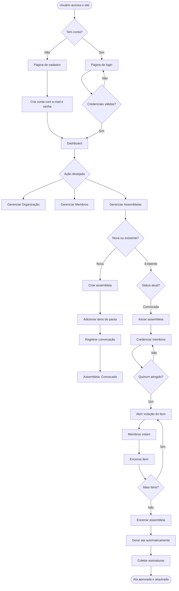
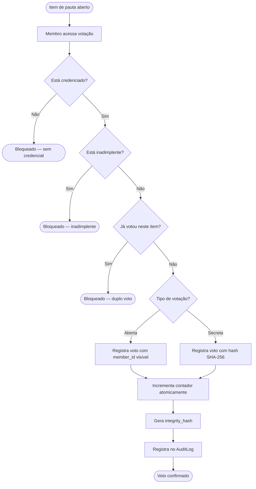
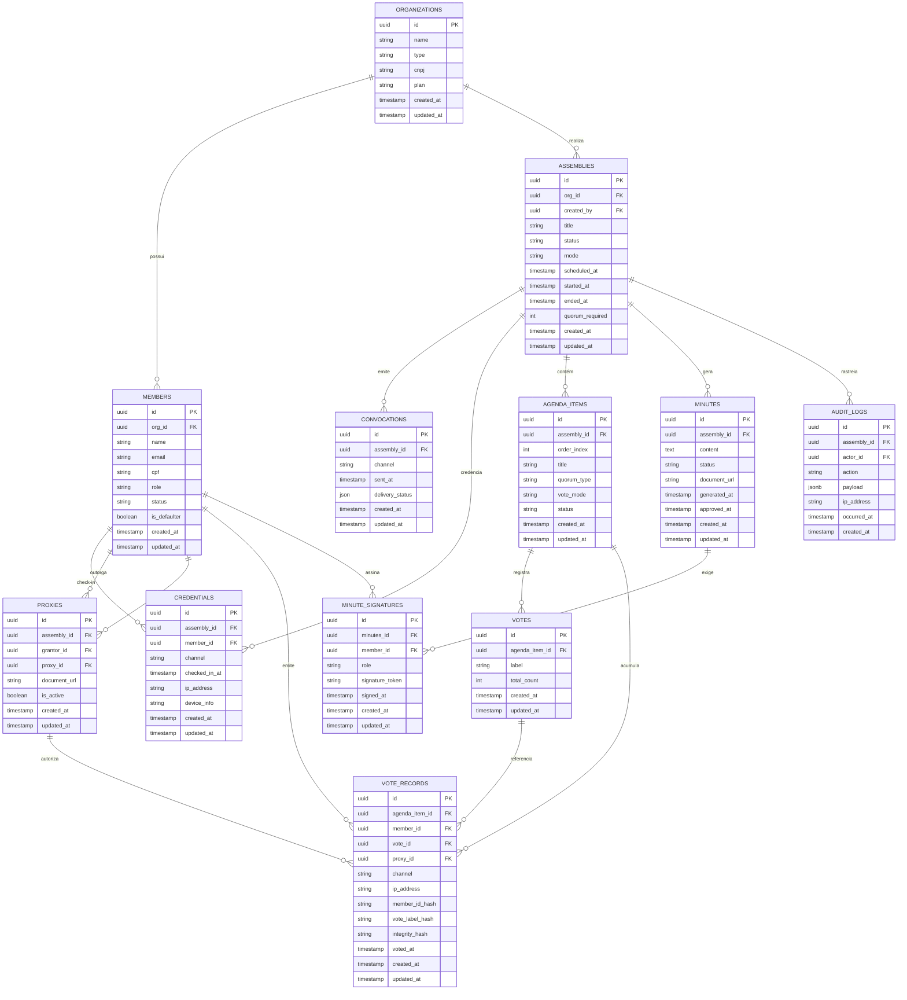

# PRD — Sistema de Gestão de Assembleias
**Versão:** 1.0  
**Data:** 2026-04-30  
**Status:** Em elaboração  

---

## Sumário

1. [Visão Geral](#1-visão-geral)
2. [Sobre o Produto](#2-sobre-o-produto)
3. [Propósito](#3-propósito)
4. [Público-alvo](#4-público-alvo)
5. [Objetivos](#5-objetivos)
6. [Requisitos Funcionais](#6-requisitos-funcionais)
7. [Requisitos Não-Funcionais](#7-requisitos-não-funcionais)
8. [Arquitetura Técnica](#8-arquitetura-técnica)
9. [Design System](#9-design-system)
10. [User Stories](#10-user-stories)
11. [Métricas de Sucesso](#11-métricas-de-sucesso)
12. [Riscos e Mitigações](#12-riscos-e-mitigações)
13. [Lista de Tarefas por Sprint](#13-lista-de-tarefas-por-sprint)

---

## 1. Visão Geral

O **AssembleiaApp** é uma plataforma web SaaS de gestão de assembleias voltada para condomínios, sindicatos e associações. O sistema digitaliza e centraliza todo o ciclo de vida de uma assembleia: da convocação ao arquivamento da ata, passando pelo credenciamento de membros, votações (presenciais, remotas ou híbridas) e geração automática de ata com assinaturas digitais.

O produto resolve um problema crônico dessas organizações: a gestão de assembleias é feita hoje em papel, planilhas e grupos de WhatsApp, gerando risco jurídico, falta de rastreabilidade e retrabalho administrativo.

---

## 2. Sobre o Produto

| Atributo | Detalhe |
|---|---|
| **Nome** | AssembleiaApp |
| **Tipo** | Aplicação web SaaS multi-tenant |
| **Acesso** | Navegador (desktop e mobile) |
| **Stack principal** | Python 3.12+, Django 5.x, TailwindCSS, SQLite |
| **Autenticação** | Email + senha (sistema nativo Django) |
| **Modelo de dados** | Multi-tenant por organização (`org_id` em todas as entidades) |
| **Fase inicial** | MVP sem Docker e sem testes automatizados |

---

## 3. Propósito

Oferecer uma ferramenta simples, segura e juridicamente aderente para que administradores de condomínios, sindicatos e associações possam:

- Convocar assembleias com rastreabilidade de entrega
- Conduzir votações com integridade auditável
- Gerar atas padronizadas e com assinaturas digitais
- Manter histórico completo de todas as deliberações

O sistema deve eliminar o risco de assembleias inválidas por falha de quórum, erro de convocação ou ausência de documentação adequada.

---

## 4. Público-alvo

| Perfil | Descrição |
|---|---|
| **Síndico / Presidente** | Administrador da organização. Cria e conduz assembleias. Usuário primário. |
| **Secretário / Operador** | Auxilia no credenciamento e registro durante a assembleia. |
| **Condômino / Associado / Filiado** | Participa das assembleias, vota e assina atas. Usuário secundário. |
| **Conselheiro / Fiscal** | Acompanha as deliberações, sem permissão de gestão. |

---

## 5. Objetivos

### Objetivos de Negócio
- Reduzir o tempo de preparação de uma assembleia em pelo menos 60%
- Eliminar assembleias inválidas por falha documental
- Garantir rastreabilidade completa de convocações e votos

### Objetivos de Produto (MVP)
- Permitir cadastro de organizações e membros
- Criar e publicar assembleias com pauta definida
- Realizar credenciamento híbrido (presencial + online)
- Conduzir votações abertas e secretas com integridade
- Gerar ata automaticamente ao final da assembleia
- Manter log de auditoria imutável de todas as ações

---

## 6. Requisitos Funcionais

### RF-01 — Autenticação e Usuários
- RF-01.1: Login via e-mail e senha (não por username)
- RF-01.2: Logout com encerramento de sessão
- RF-01.3: Cadastro de novo usuário via página pública
- RF-01.4: Redirecionamento para dashboard após login
- RF-01.5: Página pública de apresentação do sistema com opções de cadastro e login

### RF-02 — Organizações
- RF-02.1: Cadastro de organização (nome, tipo, CNPJ)
- RF-02.2: Tipos suportados: condomínio, sindicato, associação
- RF-02.3: Um usuário pode pertencer a múltiplas organizações
- RF-02.4: Cada organização tem membros com papéis distintos

### RF-03 — Membros
- RF-03.1: Cadastro de membros vinculados a uma organização
- RF-03.2: Papéis: síndico/presidente, secretário, conselheiro, membro
- RF-03.3: Status: ativo, inativo, inadimplente
- RF-03.4: Inadimplente pode ser credenciado mas não pode votar
- RF-03.5: Listagem, edição e inativação de membros

### RF-04 — Assembleias
- RF-04.1: Criar assembleia com título, descrição, data, modo e quórum mínimo
- RF-04.2: Modos: presencial, remota, híbrida
- RF-04.3: Fluxo de estados: Rascunho → Convocada → Em andamento → Encerrada → Arquivada
- RF-04.4: Listagem de assembleias com filtro por status
- RF-04.5: Visualização detalhada de cada assembleia

### RF-05 — Convocações
- RF-05.1: Registrar convocação com canal (e-mail, WhatsApp, SMS, correio, edital)
- RF-05.2: Registrar se é primeira ou segunda convocação
- RF-05.3: Registrar data de envio e status de entrega (JSON)

### RF-06 — Procurações
- RF-06.1: Registrar procuração manualmente (outorgante → procurador)
- RF-06.2: Upload opcional do documento PDF
- RF-06.3: Um membro pode outorgar apenas uma procuração por assembleia
- RF-06.4: Procurador precisa estar credenciado para votar em nome do outorgante

### RF-07 — Credenciamento
- RF-07.1: Registrar check-in de membros (presencial ou online)
- RF-07.2: Impedir duplo credenciamento do mesmo membro
- RF-07.3: Impedir credenciamento de inadimplente
- RF-07.4: Exibir contagem de credenciados em tempo real
- RF-07.5: Verificar automaticamente se quórum mínimo foi atingido

### RF-08 — Pauta e Votação
- RF-08.1: Adicionar itens de pauta com ordem, título e descrição
- RF-08.2: Cada item define tipo de quórum (simples, absoluto, 2/3, unanimidade) e modo (aberto, secreto)
- RF-08.3: Itens votados em ordem sequencial
- RF-08.4: Abertura e encerramento de cada item pelo administrador
- RF-08.5: Registro de voto por membro credenciado
- RF-08.6: Votação aberta: member_id visível no registro
- RF-08.7: Votação secreta: member_id substituído por hash SHA-256
- RF-08.8: Contador de votos atualizado de forma atômica (sem race condition)
- RF-08.9: Impedimento de duplo voto por constraint de banco
- RF-08.10: Cálculo automático de resultado conforme tipo de quórum

### RF-09 — Ata
- RF-09.1: Geração automática da ata ao encerrar a assembleia
- RF-09.2: Ata contém: dados da assembleia, quórum, itens votados, resultados e deliberações
- RF-09.3: Ata pode ser revisada antes da aprovação
- RF-09.4: Registro de assinaturas (síndico, secretário, ao menos um membro)
- RF-09.5: Ata aprovada torna-se imutável
- RF-09.6: Download da ata em formato legível

### RF-10 — Auditoria
- RF-10.1: Log imutável de todas as ações relevantes do sistema
- RF-10.2: Cada log contém: ator, ação, payload JSON, IP, timestamp
- RF-10.3: Logs nunca podem ser editados ou deletados
- RF-10.4: Visualização de logs por assembleia (apenas para administradores)

### RF-11 — Dashboard
- RF-11.1: Exibir resumo das assembleias (total, em andamento, encerradas)
- RF-11.2: Exibir atalhos para ações rápidas
- RF-11.3: Exibir próximas assembleias agendadas

---

### Fluxos de UX — Mermaid

#### Fluxo principal do sistema



#### Fluxo de votação



---

## 7. Requisitos Não-Funcionais

### RNF-01 — Desempenho
- Páginas devem carregar em menos de 2 segundos em conexão padrão
- Operações de votação devem ser atômicas e sem race condition

### RNF-02 — Segurança
- Autenticação obrigatória em todas as rotas internas
- Isolamento de dados por organização em todas as queries
- Hashing SHA-256 para dados sensíveis de votação secreta
- Logs de auditoria imutáveis (sem UPDATE/DELETE permitido)
- Proteção CSRF nativa do Django em todos os formulários

### RNF-03 — Usabilidade
- Interface responsiva (mobile-first)
- Design dark com gradientes e identidade visual consistente
- Todas as mensagens de interface em português brasileiro
- Feedback visual claro para ações (sucesso, erro, aviso)

### RNF-04 — Manutenibilidade
- Código em inglês, com type hints e docstrings em todas as funções e classes
- Linting com ruff
- Logging estruturado no terminal para todas as operações relevantes
- Separação de responsabilidades por app Django
- Código simples, sem over-engineering

### RNF-05 — Compatibilidade
- Suporte aos navegadores modernos: Chrome, Firefox, Safari, Edge
- Layout responsivo para telas a partir de 320px

### RNF-06 — Banco de Dados
- SQLite como banco padrão (fase inicial)
- Todos os models com `created_at` e `updated_at`
- UUIDs como chaves primárias
- Constraints de unicidade definidas no nível do banco

---

## 8. Arquitetura Técnica

### Stack

| Camada | Tecnologia | Versão |
|---|---|---|
| Linguagem | Python | 3.13+ |
| Framework web | Django | 6.x |
| Frontend | Django Template Language + TailwindCSS | 3.x |
| Banco de dados | SQLite | Nativo Django |
| Gerenciador de dependências | uv | latest |
| Linter / Formatter | ruff | latest |
| Logging | logging (stdlib Python) | nativo |

### Estrutura de Pastas

```
projeto/
├── core/
│   ├── models.py          # BaseModel, TenantModel (abstratos)
│   ├── middleware.py       # TenantMiddleware e outros
│   ├── permissions.py      # Permissões customizadas
│   ├── context_processors.py
│   ├── templates/
│   │   ├── base.html       # Layout base do sistema
│   │   ├── landing.html    # Página pública
│   │   └── dashboard.html  # Dashboard principal
│   └── static/
│       └── css/output.css  # TailwindCSS compilado
├── config/                 # settings.py, urls.py, wsgi.py
├── organizations/
│   ├── models.py           # Organization, Member
│   ├── views.py
│   ├── urls.py
│   ├── forms.py
│   └── templates/organizations/
├── assemblies/
│   ├── models.py           # Assembly, Convocation, Credential, Proxy
│   ├── views.py
│   ├── urls.py
│   ├── forms.py
│   ├── signals.py
│   └── templates/assemblies/
├── voting/
│   ├── models.py           # AgendaItem, Vote, VoteRecord
│   ├── views.py
│   ├── urls.py
│   ├── forms.py
│   ├── signals.py
│   └── templates/voting/
├── minutes/
│   ├── models.py           # Minutes, MinuteSignature
│   ├── views.py
│   ├── urls.py
│   ├── forms.py
│   └── templates/minutes/
├── audit/
│   ├── models.py           # AuditLog
│   ├── views.py
│   ├── urls.py
│   └── templates/audit/
├── .gitignore
├── .python-version
├── manage.py
├── pyproject.toml
├── README.md
├── uv.lock
└── erd_assembleia_mermaid.html
```

### Schema de Dados (ERD)



---

## 9. Design System

### Filosofia Visual

Interface inspirada em dashboards SaaS modernos: fundo escuro profundo com superfícies em tons de cinza-azulado, gradientes vibrantes em roxo e azul elétrico como cor de destaque, e tipografia limpa sem serifa. O resultado é uma interface que transmite confiança e profissionalismo — adequada ao contexto jurídico-administrativo das assembleias.

---

### Paleta de Cores

```
/* Fundos */
--bg-base:       #0F0F1A   /* Fundo da página */
--bg-surface:    #1A1A2E   /* Cards e painéis */
--bg-elevated:   #16213E   /* Modais, dropdowns */
--bg-border:     #2A2A45   /* Bordas e divisores */

/* Gradiente de destaque */
--grad-primary:  linear-gradient(135deg, #7C3AED, #2563EB)
--grad-subtle:   linear-gradient(135deg, #7C3AED22, #2563EB22)
--grad-hover:    linear-gradient(135deg, #6D28D9, #1D4ED8)

/* Cores sólidas */
--accent-purple: #7C3AED   /* Ações primárias */
--accent-blue:   #2563EB   /* Links e destaques */
--accent-teal:   #0D9488   /* Sucesso e confirmação */
--accent-amber:  #D97706   /* Avisos */
--accent-red:    #DC2626   /* Erros e perigos */

/* Texto */
--text-primary:  #F1F5F9   /* Títulos e rótulos */
--text-secondary:#94A3B8   /* Textos de apoio */
--text-muted:    #475569   /* Placeholders */
```

### Tipografia

```
/* Fonte principal */
font-family: 'Inter', system-ui, sans-serif;

/* Escala */
--text-xs:   0.75rem   / 12px  — labels, badges
--text-sm:   0.875rem  / 14px  — texto de apoio, inputs
--text-base: 1rem      / 16px  — corpo padrão
--text-lg:   1.125rem  / 18px  — subtítulos de card
--text-xl:   1.25rem   / 20px  — títulos de seção
--text-2xl:  1.5rem    / 24px  — títulos de página
--text-4xl:  2.25rem   / 36px  — hero da landing

/* Pesos */
font-weight: 400   — corpo
font-weight: 500   — subtítulos, labels
font-weight: 600   — títulos e botões
font-weight: 700   — hero e headings principais
```

### Classes TailwindCSS — Componentes Base

#### Layout Base
```html
<!-- Fundo da página -->
<body class="bg-[#0F0F1A] text-slate-100 font-sans antialiased min-h-screen">

<!-- Container padrão -->
<div class="max-w-7xl mx-auto px-4 sm:px-6 lg:px-8">

<!-- Card / Painel -->
<div class="bg-[#1A1A2E] border border-[#2A2A45] rounded-xl p-6 shadow-lg">

<!-- Card com gradiente sutil -->
<div class="bg-gradient-to-br from-[#7C3AED11] to-[#2563EB11]
            border border-[#7C3AED33] rounded-xl p-6">
```

#### Botões
```html
<!-- Botão primário (gradiente) -->
<button class="bg-gradient-to-r from-violet-600 to-blue-600
               hover:from-violet-700 hover:to-blue-700
               text-white font-semibold px-6 py-2.5 rounded-lg
               transition-all duration-200 shadow-lg
               shadow-violet-500/25 focus:outline-none
               focus:ring-2 focus:ring-violet-500 focus:ring-offset-2
               focus:ring-offset-[#0F0F1A]">
  Ação Primária
</button>

<!-- Botão secundário (outline) -->
<button class="border border-[#2A2A45] hover:border-violet-500
               text-slate-300 hover:text-white font-medium
               px-6 py-2.5 rounded-lg transition-all duration-200
               hover:bg-violet-500/10">
  Ação Secundária
</button>

<!-- Botão de perigo -->
<button class="bg-red-600/20 hover:bg-red-600/30 border border-red-500/50
               text-red-400 hover:text-red-300 font-medium
               px-6 py-2.5 rounded-lg transition-all duration-200">
  Excluir
</button>

<!-- Botão pequeno / badge-action -->
<button class="text-xs font-medium px-3 py-1 rounded-md
               bg-violet-500/20 text-violet-300
               hover:bg-violet-500/30 transition-colors">
  Ver detalhes
</button>
```

#### Inputs e Formulários
```html
<!-- Label -->
<label class="block text-sm font-medium text-slate-300 mb-1.5">
  Nome do campo
</label>

<!-- Input padrão -->
<input type="text"
       class="w-full bg-[#0F0F1A] border border-[#2A2A45]
              focus:border-violet-500 focus:ring-1 focus:ring-violet-500
              text-slate-100 placeholder-slate-500 rounded-lg
              px-4 py-2.5 text-sm transition-colors outline-none">

<!-- Select -->
<select class="w-full bg-[#0F0F1A] border border-[#2A2A45]
               focus:border-violet-500 focus:ring-1 focus:ring-violet-500
               text-slate-100 rounded-lg px-4 py-2.5 text-sm
               transition-colors outline-none">

<!-- Textarea -->
<textarea class="w-full bg-[#0F0F1A] border border-[#2A2A45]
                 focus:border-violet-500 focus:ring-1 focus:ring-violet-500
                 text-slate-100 placeholder-slate-500 rounded-lg
                 px-4 py-2.5 text-sm transition-colors outline-none resize-none">

<!-- Fieldset / grupo de campos -->
<div class="space-y-4 bg-[#1A1A2E] border border-[#2A2A45]
            rounded-xl p-6">
  <!-- campos aqui -->
</div>

<!-- Mensagem de erro -->
<p class="mt-1.5 text-xs text-red-400 flex items-center gap-1">
  <span>⚠</span> Mensagem de erro aqui
</p>
```

#### Badges de Status
```html
<!-- Status: Rascunho -->
<span class="inline-flex items-center px-2.5 py-0.5 rounded-full
             text-xs font-medium bg-slate-500/20 text-slate-400
             border border-slate-500/30">
  Rascunho
</span>

<!-- Status: Convocada -->
<span class="inline-flex items-center px-2.5 py-0.5 rounded-full
             text-xs font-medium bg-blue-500/20 text-blue-400
             border border-blue-500/30">
  Convocada
</span>

<!-- Status: Em andamento -->
<span class="inline-flex items-center px-2.5 py-0.5 rounded-full
             text-xs font-medium bg-violet-500/20 text-violet-400
             border border-violet-500/30">
  Em andamento
</span>

<!-- Status: Encerrada -->
<span class="inline-flex items-center px-2.5 py-0.5 rounded-full
             text-xs font-medium bg-teal-500/20 text-teal-400
             border border-teal-500/30">
  Encerrada
</span>

<!-- Status: Arquivada -->
<span class="inline-flex items-center px-2.5 py-0.5 rounded-full
             text-xs font-medium bg-amber-500/20 text-amber-400
             border border-amber-500/30">
  Arquivada
</span>
```

#### Navegação (Sidebar)
```html
<aside class="w-64 bg-[#1A1A2E] border-r border-[#2A2A45]
              min-h-screen flex flex-col">

  <!-- Logo -->
  <div class="p-6 border-b border-[#2A2A45]">
    <span class="text-xl font-bold bg-gradient-to-r from-violet-400
                 to-blue-400 bg-clip-text text-transparent">
      AssembleiaApp
    </span>
  </div>

  <!-- Menu item ativo -->
  <a href="#" class="flex items-center gap-3 px-4 py-3 mx-2 rounded-lg
                     bg-gradient-to-r from-violet-600/20 to-blue-600/20
                     border border-violet-500/30 text-violet-300
                     font-medium text-sm">
    <svg><!-- ícone --></svg>
    Assembleias
  </a>

  <!-- Menu item inativo -->
  <a href="#" class="flex items-center gap-3 px-4 py-3 mx-2 rounded-lg
                     text-slate-400 hover:text-slate-200
                     hover:bg-white/5 font-medium text-sm
                     transition-colors">
    <svg><!-- ícone --></svg>
    Membros
  </a>
</aside>
```

#### Grid de Cards para Dashboard
```html
<!-- Grid de métricas (4 colunas) -->
<div class="grid grid-cols-1 sm:grid-cols-2 lg:grid-cols-4 gap-4">

  <!-- Card de métrica -->
  <div class="bg-[#1A1A2E] border border-[#2A2A45] rounded-xl p-5
              hover:border-violet-500/50 transition-colors group">
    <p class="text-sm text-slate-400 font-medium">Assembleias ativas</p>
    <p class="text-3xl font-bold text-slate-100 mt-2">12</p>
    <p class="text-xs text-teal-400 mt-1">↑ 3 este mês</p>
  </div>
</div>

<!-- Grid de conteúdo (lista + detalhe) -->
<div class="grid grid-cols-1 lg:grid-cols-3 gap-6">
  <div class="lg:col-span-2"> <!-- lista --> </div>
  <div class="lg:col-span-1"> <!-- detalhe / ações --> </div>
</div>
```

#### Tabela
```html
<div class="bg-[#1A1A2E] border border-[#2A2A45] rounded-xl overflow-hidden">
  <table class="w-full text-sm">
    <thead>
      <tr class="border-b border-[#2A2A45] bg-[#0F0F1A]/50">
        <th class="px-6 py-3 text-left text-xs font-semibold
                   text-slate-400 uppercase tracking-wider">
          Nome
        </th>
      </tr>
    </thead>
    <tbody class="divide-y divide-[#2A2A45]">
      <tr class="hover:bg-white/[0.02] transition-colors">
        <td class="px-6 py-4 text-slate-200">Assembleia Geral</td>
      </tr>
    </tbody>
  </table>
</div>
```

#### Alertas e Notificações
```html
<!-- Sucesso -->
<div class="flex items-start gap-3 p-4 rounded-lg
            bg-teal-500/10 border border-teal-500/30 text-teal-300">
  <span class="text-teal-400 mt-0.5">✓</span>
  <p class="text-sm">Operação realizada com sucesso.</p>
</div>

<!-- Erro -->
<div class="flex items-start gap-3 p-4 rounded-lg
            bg-red-500/10 border border-red-500/30 text-red-300">
  <span class="text-red-400 mt-0.5">✕</span>
  <p class="text-sm">Ocorreu um erro. Tente novamente.</p>
</div>

<!-- Aviso -->
<div class="flex items-start gap-3 p-4 rounded-lg
            bg-amber-500/10 border border-amber-500/30 text-amber-300">
  <span class="text-amber-400 mt-0.5">⚠</span>
  <p class="text-sm">Atenção: quórum mínimo não atingido.</p>
</div>
```

### Página de Login (estrutura)

```html
<!-- Página de login: fundo com gradiente radial sutil -->
<div class="min-h-screen bg-[#0F0F1A] flex items-center justify-center
            relative overflow-hidden">

  <!-- Glow decorativo de fundo -->
  <div class="absolute top-1/4 left-1/2 -translate-x-1/2 -translate-y-1/2
              w-96 h-96 bg-violet-600/20 rounded-full blur-3xl pointer-events-none">
  </div>

  <!-- Card central -->
  <div class="relative z-10 w-full max-w-md bg-[#1A1A2E]
              border border-[#2A2A45] rounded-2xl p-8 shadow-2xl">

    <!-- Logo + título -->
    <div class="text-center mb-8">
      <h1 class="text-2xl font-bold bg-gradient-to-r from-violet-400
                 to-blue-400 bg-clip-text text-transparent">
        AssembleiaApp
      </h1>
      <p class="text-slate-400 text-sm mt-2">
        Acesse sua conta para continuar
      </p>
    </div>

    <!-- Formulário -->
    <form method="post" class="space-y-5">
      <!-- campos -->
      <button type="submit"
              class="w-full bg-gradient-to-r from-violet-600 to-blue-600
                     hover:from-violet-700 hover:to-blue-700 text-white
                     font-semibold py-2.5 rounded-lg transition-all
                     duration-200 shadow-lg shadow-violet-500/25">
        Entrar
      </button>
    </form>
  </div>
</div>
```

---

## 10. User Stories

### Épico 1 — Autenticação e Acesso

**US-01** — Como visitante, quero me cadastrar com e-mail e senha para acessar o sistema.
- **Critérios de aceite:**
  - [ ] Formulário solicita nome, e-mail e senha
  - [ ] E-mail deve ser único no sistema
  - [ ] Senha com no mínimo 8 caracteres
  - [ ] Após cadastro, usuário é redirecionado ao dashboard
  - [ ] Mensagens de erro em português

**US-02** — Como usuário, quero fazer login com meu e-mail para acessar minha conta.
- **Critérios de aceite:**
  - [ ] Campo de login aceita e-mail (não username)
  - [ ] Mensagem clara para credenciais inválidas
  - [ ] Redirecionamento ao dashboard após login bem-sucedido
  - [ ] Sessão mantida entre navegações

---

### Épico 2 — Organizações e Membros

**US-03** — Como administrador, quero cadastrar minha organização para centralizar a gestão.
- **Critérios de aceite:**
  - [ ] Formulário com nome, tipo (condomínio/sindicato/associação) e CNPJ
  - [ ] Organização aparece no dashboard após criação
  - [ ] Campos obrigatórios validados no backend

**US-04** — Como administrador, quero cadastrar membros da organização com seus papéis e status.
- **Critérios de aceite:**
  - [ ] Formulário com nome, e-mail, CPF, papel e status
  - [ ] Listagem de membros com filtro por status
  - [ ] Possibilidade de marcar membro como inadimplente
  - [ ] Edição e inativação de membro

---

### Épico 3 — Assembleias

**US-05** — Como síndico, quero criar uma assembleia com pauta definida para convocar os membros.
- **Critérios de aceite:**
  - [ ] Formulário com título, descrição, data, modo e quórum mínimo
  - [ ] Após criação, status inicia como "Rascunho"
  - [ ] Possibilidade de adicionar itens de pauta com ordem e tipo de votação
  - [ ] Registro de convocação com canal e data de envio

**US-06** — Como síndico, quero iniciar a assembleia e credenciar os membros presentes.
- **Critérios de aceite:**
  - [ ] Botão "Iniciar" disponível apenas para assembleias Convocadas
  - [ ] Check-in individual por membro com canal (presencial/online)
  - [ ] Contador de credenciados atualizado em tempo real
  - [ ] Indicador visual quando quórum mínimo é atingido
  - [ ] Inadimplentes bloqueados no check-in

**US-07** — Como síndico, quero conduzir as votações dos itens de pauta em ordem.
- **Critérios de aceite:**
  - [ ] Itens listados na ordem definida
  - [ ] Cada item abre e fecha individualmente
  - [ ] Resultado calculado automaticamente conforme tipo de quórum
  - [ ] Votação secreta não expõe membro ao voto
  - [ ] Impossibilidade de votar sem estar credenciado

---

### Épico 4 — Ata

**US-08** — Como síndico, quero gerar a ata automaticamente ao encerrar a assembleia.
- **Critérios de aceite:**
  - [ ] Ata gerada com todos os dados da assembleia
  - [ ] Inclui quórum, itens votados e resultados
  - [ ] Status inicial da ata: "Em revisão"
  - [ ] Possibilidade de aprovar a ata
  - [ ] Após aprovação, ata torna-se imutável

**US-09** — Como membro, quero assinar digitalmente a ata para validá-la.
- **Critérios de aceite:**
  - [ ] Registro de assinatura com token único e timestamp
  - [ ] Identificação do papel do assinante (síndico, secretário, membro)
  - [ ] Ata só é aprovada após assinaturas mínimas

---

### Épico 5 — Auditoria

**US-10** — Como administrador, quero visualizar o log de auditoria de uma assembleia.
- **Critérios de aceite:**
  - [ ] Lista cronológica de todas as ações
  - [ ] Exibe ator, ação, IP e timestamp
  - [ ] Filtro por tipo de ação
  - [ ] Logs não editáveis nem deletáveis

---

## 11. Métricas de Sucesso

### KPIs de Produto
| Métrica | Meta (3 meses) |
|---|---|
| Assembleias criadas por organização/mês | ≥ 2 |
| Taxa de conclusão de assembleia (até ata aprovada) | ≥ 70% |
| Tempo médio de preparação de assembleia | < 30 min |
| Taxa de erro em votações (duplo voto, etc.) | 0% |

### KPIs de Usuário
| Métrica | Meta |
|---|---|
| Tempo médio para aprender a criar uma assembleia | < 15 min |
| Satisfação do administrador (NPS implícito) | Positivo |
| Taxa de abandono no credenciamento | < 10% |

### KPIs Técnicos
| Métrica | Meta |
|---|---|
| Tempo de resposta das páginas | < 2s |
| Erros 500 em produção | 0 por semana |
| Integridade dos VoteRecords (hash válido) | 100% |

---

## 12. Riscos e Mitigações

| # | Risco | Probabilidade | Impacto | Mitigação |
|---|---|---|---|---|
| R01 | Duplo voto por race condition | Média | Alto | `F()` expressions + `UniqueConstraint` no banco |
| R02 | Dados de um tenant visíveis a outro | Baixa | Crítico | `TenantModel` com `org_id` obrigatório em todas as queries |
| R03 | Ata editada após aprovação | Baixa | Alto | `save()` bloqueado após status `approved` |
| R04 | Log de auditoria deletado | Muito baixa | Alto | `delete()` e `save()` bloqueados em `AuditLog` |
| R05 | Assembleia inválida por quórum não verificado | Média | Médio | Verificação de quórum antes de abrir votação |
| R06 | Votação secreta exposta por bug | Baixa | Alto | Hash SHA-256 do member_id, FK nula em VoteRecord secreto |
| R07 | Escopo crescente sem entregas | Alta | Médio | MVP bem definido, sprints com escopo fixo |

---

